<p align="center">
<picture>
  <source media="(prefers-color-scheme: dark)" srcset="./Assets/DPChartsLogo.png">
  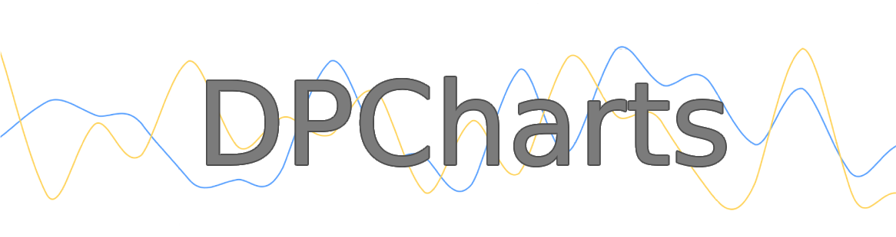
</picture>
</p>


DPCharts is a Swift-based lightweight framework designed specifically for rendering charts on iOS. Its main objective is to create a user-friendly chart library that follows the iOS delegation pattern approach. Each chart within the framework is responsible solely for presenting data, rather than managing the data itself. To manage the data, you provide the chart with a datasource object (an object conforming to the chart datasource protocol). Additionally, charts manage gesture interaction, and touch gesture events are delivered to the configured delegate (an object conforming to the chart delegate protocol) when applicable.

## Table of contents

* [Feature Highlights](#feature-highlights)
* [Available Charts](#available-charts)
    * [BarChart](#barchart)
    * [BarChart (stacked)](#barchart-stacked)
    * [LineChart](#linechart)
    * [LineChart (with area)](#linechart-with-area)
    * [LineChart (with bezier curve)](#linechart-with-bezier-curve)
    * [LineChart (with bezier curve and area)](#linechart-with-bezier-curve-and-area)
    * [ScatterChart](#scatterchart)
    * [PieChart](#piechart)
    * [PieChart (as Donut)](#piechart-as-donut)
    * [Heatmap](#heatmap)
* [Requirements](#requirements)
* [Installation](#installation)
    * [Cocoapods](#cocoapods)
    * [Swift Package Manager](#swift-package-manager)
* [Running the demo](#running-the-demo)
* [Documentation](#documentation)
* [Contributing](#contributing)

## Feature Highlights

DPCharts provides several features and extensive customization options. Presented below is a concise list showcasing some of its capabilities:

- **5** different chart types
- **Legend** support using a specific view (see [DPLegendView](./Sources/DPCharts/Views/DPLegendView/DPLegendView.swift))
- **Storyboard** support by means of **@IBDesignable** and **@IBInspectable**
- **Animations** support (where applicable)
- **Touch gesture** interaction
- Highly customizable (colors, fonts, axis positioning, spacing, insets ...)

- Data control achieved by implementing a **datasource** protocol
- User interaction by means of implementing a **delegate** protocol
- APIs that resemble well-known UIKit views like **UITableView** and **UICollectionView**

## Available Charts

### BarChart

A bar chart is a graphical representation of data using rectangular bars to represent different categories or variables. Each bar's length corresponds to the value or frequency of the category it represents.

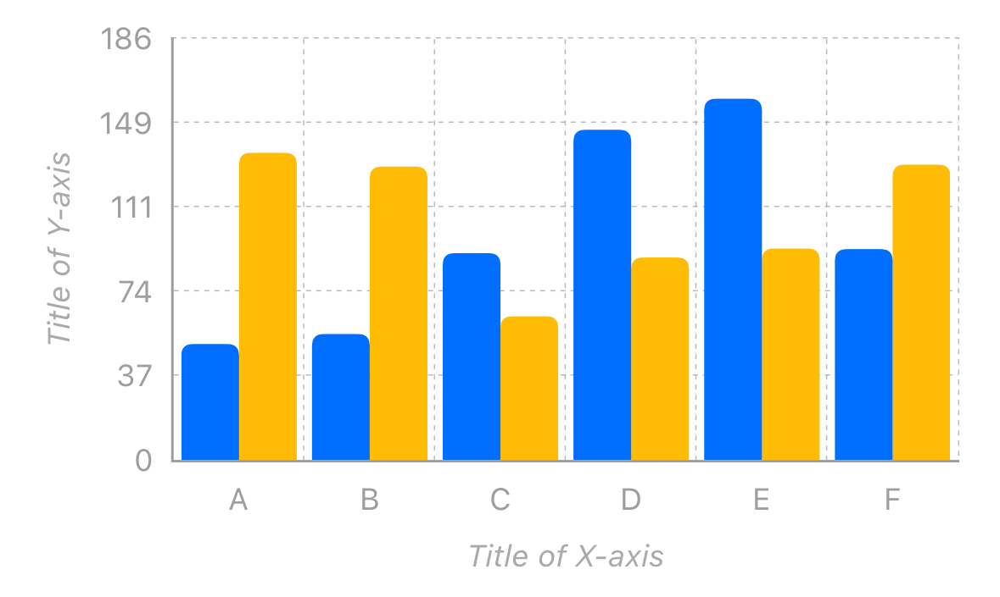

```swift
let barChartView = DPBarChartView()
barChartView.datasource = self
barChartView.barStacked = false
barChartView.xAxisTitle = "Title of X-axis"
barChartView.yAxisInverted = false
barChartView.yAxisMarkersWidthRetained = true
barChartView.yAxisTitle = "Title of Y-axis"
```

### BarChart (stacked)


A stacked bar chart is a type of graphical representation that uses rectangular bars to display multiple categories or variables, stacked on top of one another. Each bar segment represents a specific category or subgroup, and the total height of the stacked bars corresponds to the cumulative value or frequency of the variables being represented.

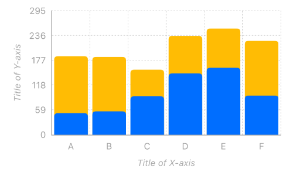

```swift
let barChartView = DPBarChartView()
barChartView.datasource = self
barChartView.barStacked = true
barChartView.xAxisTitle = "Title of X-axis"
barChartView.yAxisInverted = false
barChartView.yAxisMarkersWidthRetained = true
barChartView.yAxisTitle = "Title of Y-axis"
```

### LineChart

A line chart is a graphical representation of data that uses lines to connect data points, typically showing the relationship or trend between two or more variables over a specific period.

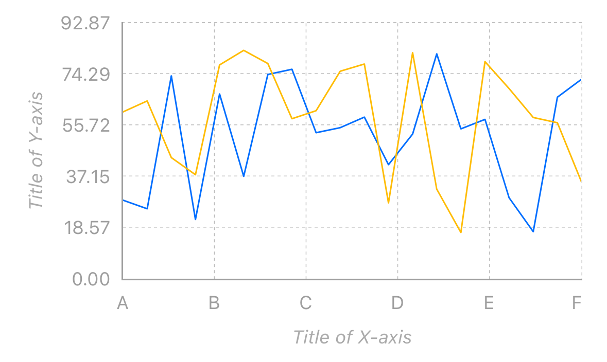

```swift
let lineChartView = DPLineChartView()
lineChartView.datasource = self
lineChartView.bezierCurveEnabled = false
lineChartView.areaEnabled = false
lineChartView.xAxisTitle = "Title of X-axis"
lineChartView.yAxisInverted = false
lineChartView.yAxisMarkersWidthRetained = true
lineChartView.yAxisTitle = "Title of Y-axis"
```

### LineChart (with area)

A line chart with an area is a type of graphical representation that combines the features of a traditional line chart with the addition of a shaded area beneath the line. The line represents the trend or relationship between variables over time or a continuous scale, while the shaded area beneath the line represents the cumulative values or frequencies.

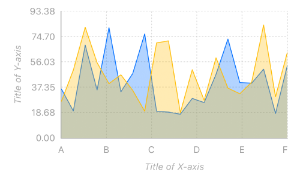

```swift
let lineChartView = DPLineChartView()
lineChartView.datasource = self
lineChartView.bezierCurveEnabled = false
lineChartView.areaEnabled = true
lineChartView.xAxisTitle = "Title of X-axis"
lineChartView.yAxisInverted = false
lineChartView.yAxisMarkersWidthRetained = true
lineChartView.yAxisTitle = "Title of Y-axis"
```

### LineChart (with bezier curve)

A line chart with a Bezier curve is a special graphical representation of a line chart that uses a smooth, curved line to connect data points, showing the trend or relationship between variables over time or a continuous scale. The Bezier curve is a mathematical curve that provides a smooth and visually appealing interpolation between data points.

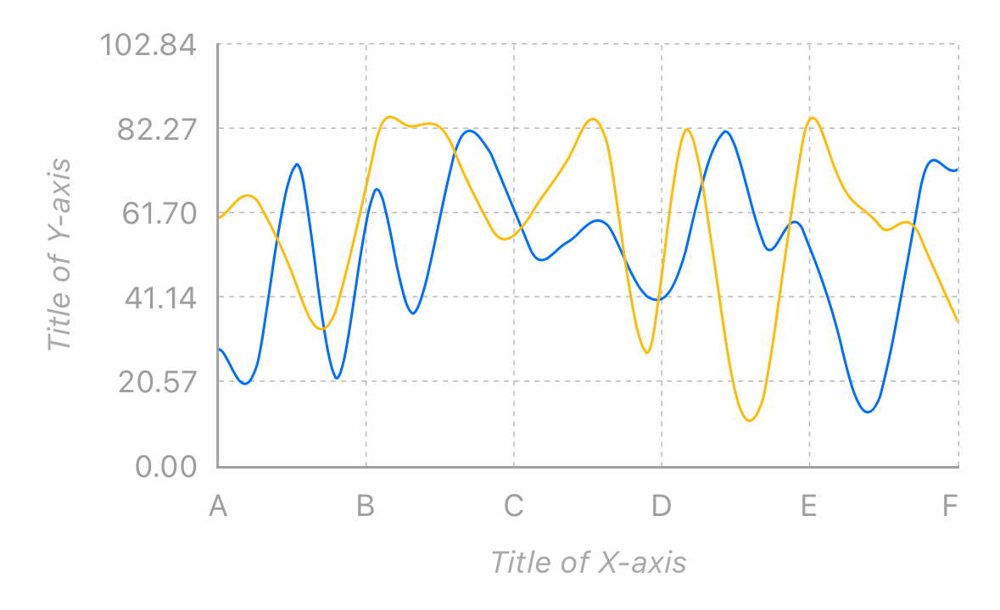

```swift
let lineChartView = DPLineChartView()
lineChartView.datasource = self
lineChartView.bezierCurveEnabled = true
lineChartView.areaEnabled = false
lineChartView.xAxisTitle = "Title of X-axis"
lineChartView.yAxisInverted = false
lineChartView.yAxisMarkersWidthRetained = true
lineChartView.yAxisTitle = "Title of Y-axis"
```

### LineChart (with bezier curve and area)

A line chart with a Bezier curve and an area combines the smooth, curved line of a Bezier curve with the added visual representation of the cumulative values or frequencies through a shaded area beneath the curve.

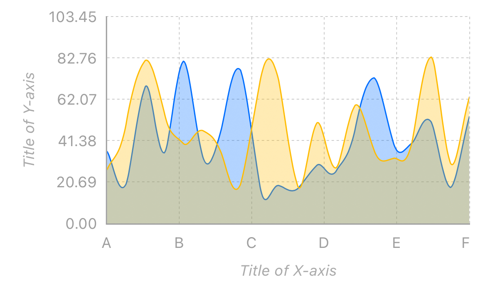

```swift
let lineChartView = DPLineChartView()
lineChartView.datasource = self
lineChartView.bezierCurveEnabled = true
lineChartView.areaEnabled = true
lineChartView.xAxisTitle = "Title of X-axis"
lineChartView.yAxisInverted = false
lineChartView.yAxisMarkersWidthRetained = true
lineChartView.yAxisTitle = "Title of Y-axis"
```

### ScatterChart

A scatter chart, also known as a scatter plot, is a graphical representation that displays individual data points as dots on a two-dimensional coordinate system. It is used to show the relationship or correlation between two variables. Each data point on the chart represents a specific value pair for the two variables being analyzed.

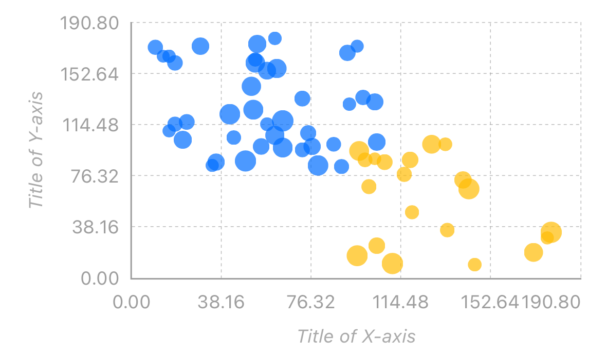

```swift
let scatterChartView = DPScatterChartView()
scatterChartView.datasource = self
scatterChartView.xAxisTitle = "Title of X-axis"
scatterChartView.yAxisInverted = false
scatterChartView.yAxisMarkersWidthRetained = true
scatterChartView.yAxisTitle = "Title of Y-axis"
```

### PieChart

A pie chart is a circular graphical representation that visually displays data as slices of a pie. Each slice in the chart represents a different category or variable, and the size of each slice corresponds to the proportion or percentage of the whole it represents.

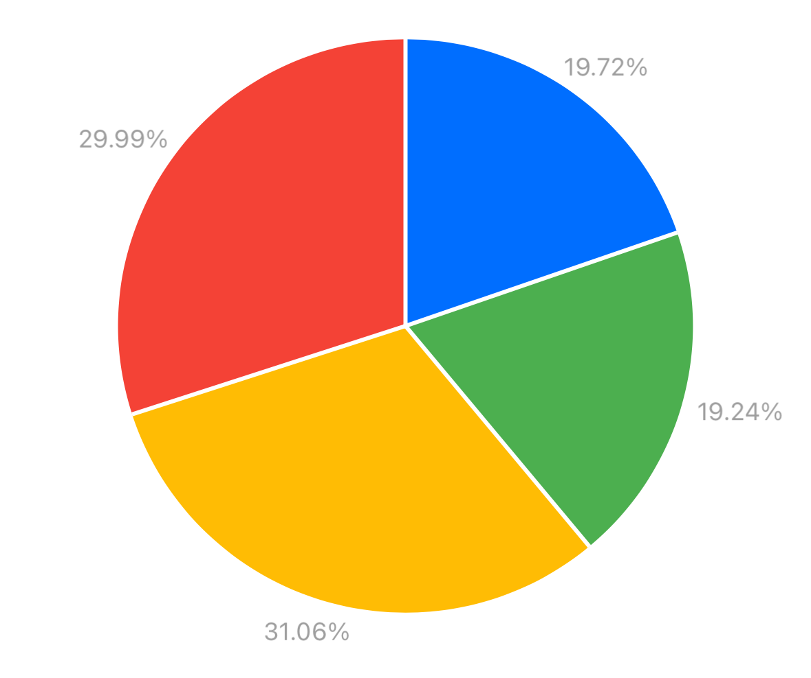

```swift
let pieChartView = DPPieChartView()
pieChartView.datasource = self
pieChartView.donutEnabled = false
```

### PieChart (as Donut)

A donut chart is a circular graphical representation similar to a pie chart, but with a hollow center. It is formed by creating a hole in the middle of the pie chart, resulting in a ring-like structure.

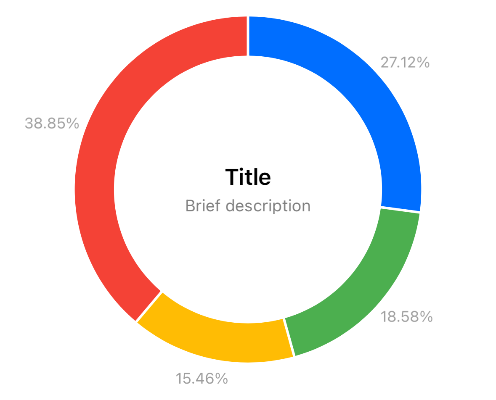

```swift
let pieChartView = DPPieChartView()
pieChartView.datasource = self
pieChartView.labelsColor = .grey500
pieChartView.donutEnabled = true
pieChartView.donutTitle = "Title"
pieChartView.donutSubtitle = "Brief description"
pieChartView.donutVerticalSpacing = 4.0
```

### Heatmap

A heatmap chart is a graphical representation that uses color-coded cells or rectangles to display data in a matrix or table format. It is particularly useful for visualizing and analyzing data sets that have multiple variables or dimensions.
In a heatmap chart, each cell in the matrix represents a specific combination of variables or categories. The color of each cell is determined by the value or magnitude of the data it represents. Typically, a color gradient is used, where lighter or darker shades of a color represent higher or lower values, respectively.

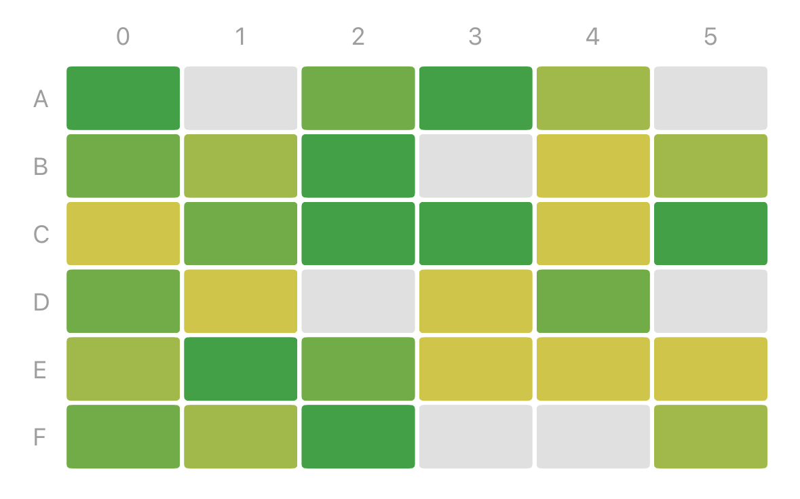

```swift
let heatmapView = DPHeatMapView()
heatmapView.datasource = self
heatmapView.xAxisInverted = false
heatmapView.yAxisInverted = false
```

## Requirements

DPCharts can be installed on any platform that is compatible with it:

- iOS **12+**
- Xcode **14+** 
- Swift **5.5+**  

## Installation

### Cocoapods

Add the dependency to the `DPCharts` framework in your `Podfile`:

```ruby
pod 'DPCharts', '~> 1.0.0'
```

### Swift Package Manager

Add it as a dependency in a Swift Package:

```swift
dependencies: [
    .package(url: "https://github.com/danielepantaleone/DPCharts.git", .upToNextMajor(from: "1.0.0"))
]
```

## Running the demo

DPCharts includes a demo application to showcases all the chart features it offers.

- Make sure you are running a supported version of Xcode.
- Open the `DPCharts-Demo-iOS/DPCharts-Demo-iOS.xcodeproj` Xcode project.
- Run the `DPCharts-Demo-iOS` on a simulator.

## Documentation

This library is currently lacking any form of structured documentation. However, Swift documentation can be accessed directly in Xcode Quick Help. Currently, there is no need for comprehensive documentation because using DPCharts' views simply involves adding the desired chart subview to your ViewController hierarchy and configuring a datasource and delegate (resemble **UITableView** and **UICollectionView** usage). Storyboard in-place configuration is also supported.

If you need assistance in using DPCharts please [open an issue](https://github.com/danielepantaleone/DPCharts/issues).

## Contributing

If you like this project you can contribute it by:

- Submit a Bug Report by opening an [issue](https://github.com/danielepantaleone/DPCharts/issues)
- Submit code by opening a [pull request](https://github.com/danielepantaleone/DPCharts/pulls)